#   Minimum Kapsayan Ağaçlar

.fx: first

Azhar MURZAEVA

Şeymanur ÇALIK

`ALGORİTMALAR`

Öğretmen: Nurettin ŞENYER

Mayıs 2016

---

###İçerik
- Graph(Çizge) nedir?
- Ağaç nedir?
- Kullanılan alanlar
- Minimum Kapsayan Ağaçlar nedir?
- Kullanılan alanlar
- Prim Algoritması
- Kruskal Algoritması

###Graph(Çizge) nedir?

- `Çizge` veya `Graf`, düğümler ve bu düğümleri birbirine bağlayan kenarlardan oluşan bir tür ağ yapısıdır. Örnek bir çizge:

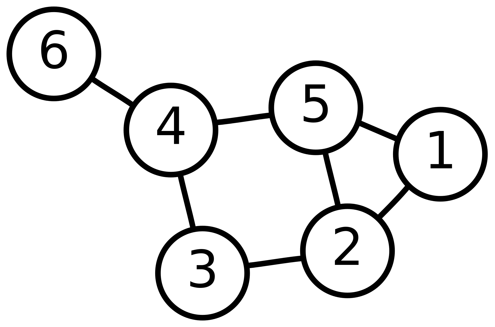

###Ağaç(Tree) Nedir?

- Eğer ki, graf bağlı bir graf ise ve bu graf hiç döngü içermiyorsa, bu graf türüne Ağaç denmektedir. Örnek bir Ağaç:

###Kullanılan Alanlar

- Matematikte
- Fizikte
- Biyolojide

###Minimum Kapsayan Ağaç Nedir?

- Düğümlerinin aralarında bağlantı olmayan bir graf verilsin. Bu graf için öyle bir ağaç bulunmalı ki, onun bütün güğümlerine bağlı olsun ve aynı anda olası olan bütün maliyetlerinin en azına sahip olsun. İşte böyle ağaca minimum kapsayan ağaç denmektedir.

####Minimum Kapsayan Ağaç

- Bir çizge(graf) birçok kapsayan ağacı içerebilir. Örneğin, 
4 düğümlü bir çizge:

16 tane kapsayan ağaca sahiptir:

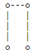

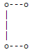

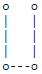

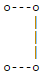

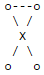

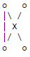

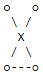

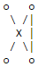

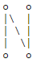

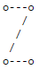

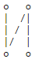

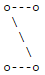

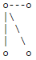

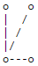

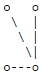

####Minimum Kapsayan Ağaç(Devamı)

Minimum kapsayan ağaç bulmak için çeşitli algoritmalar vardır. Bunlardan en ünlü olan bazılar aşağıdakilerdir: 

- Prim Algoritması
- Kruskal Algoritması
- Boruvka(Sollin) Algoritması

####Prim Algoritması

Bu algoritma 1930 yılında matematikçi Vojtech Jarnik tarafından bulunmuştur. Daha sonra bağımsız olarak 1957'de bilgisayar bilimcisi Robert C. Prim ve 1959'da Dijkstra tarafından tekrar bulunmuştur. 

####Prim Algoritması(Devamı)

####Prim Algoritması(Devamı)

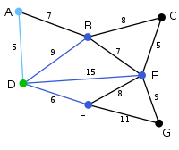

####Prim Algoritması(Devamı)

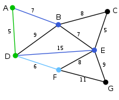

####Prim Algoritması(Devamı)

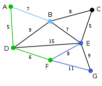

####Prim Algoritması(Devamı)

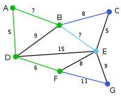

####Prim Algoritması(Devamı)

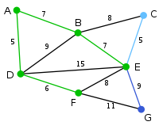

####Prim Algoritması(Devamı)

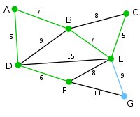

####Prim Algoritması(Devamı)

####Kruskal Algoritması

Kruskal algoritması Joseph Kruskal tarafından geliştirilmiş ve ilk kez 1956 yılında anlatılmıştır. 
Kruskal algoritması her seferinde en iyi kenarın seçilmesi esasına dayalıdır.

- n kenarlı bir graf için herhangi bir düğümle başlanır ve en kısa yol buna eklenir. 
- Döngü oluşturmayacak şekilde (n-1) kenar eklenene kadar devam edilir. 
- Aynı değerli kenarlarda seçim keyfi yapılabilir.
- Düğümlerin birleştirilme işlemine en az maliyetli kenardan başlanır, kalan kenarlar arasından en az maliyetlisi seçilerek devam edilir.

####Kruskal Algoritması(Devamı)

####Kruskal Algoritması(Devamı)

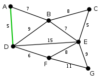

####Kruskal Algoritması(Devamı)

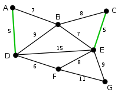

####Kruskal Algoritması(Devamı)

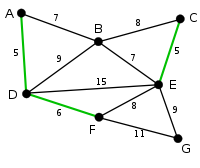

####Kruskal Algoritması(Devamı)

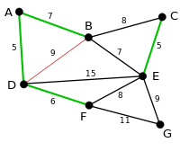

####Kruskal Algoritması(Devamı)

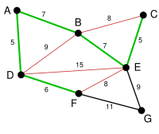

####Kruskal Algoritması(Devamı)

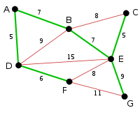

####Minimum Kapsayan Ağaçlar

- Dikkatiniz için Teşekkürler...
- Sorular???

